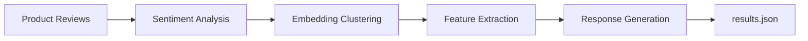

# Introduction

Your company makes **Jarvis**, an AI-powered personal assistant. Users are leaving reviews on your product page — some praising the natural language understanding, others complaining about bugs, and everything in between. Your product team wants to understand this feedback at scale: What are users experiencing? What needs fixing? How do you respond to hundreds of reviews without burning out your support team?

In this lab, you'll build an automated pipeline that processes product reviews using local AI models. Every model call runs on your own machine via **Docker Model Runner** — no API keys, no cloud subscriptions, no data leaving your environment.

## What you'll build

By the end of this lab, your pipeline will:

1. **Generate** synthetic product reviews (so you have realistic test data)
2. **Analyze sentiment** — classify each review as positive, negative, or neutral
3. **Cluster similar feedback** using semantic embeddings and cosine similarity
4. **Extract actionable features** from each cluster using structured LLM output
5. **Generate responses** to each review, aware of what your team is working on



## What is Docker Model Runner?

Docker Model Runner is built into Docker Desktop. It lets you pull and run AI models locally — the same way you pull and run container images. Once a model is running, it exposes an **OpenAI-compatible HTTP API** on `localhost`, so any code that works with the OpenAI SDK works with Docker Model Runner too.

This means:
- No API keys or accounts required
- Models run entirely on your hardware
- The same code works whether you're using a local model or a cloud API

In this lab you'll use two models:

| Model | Purpose |
|-------|---------|
| Gemma3 (your choice — see below) | Text generation — analysis, extraction, responses |
| `ai/mxbai-embed-large` | Embeddings — converting text into semantic vectors for clustering |

## Choose your Gemma3 variant

Gemma3 comes in two variants for this lab. Pick the one that fits your hardware:

| Variant | VRAM required | Quality | Best for |
|---------|--------------|---------|----------|
| `ai/gemma3:4B-F16` | ~9 GB | Full float16 precision | Apple Silicon (M1/M2/M3/M4), GPUs with ≥ 10 GB VRAM |
| `ai/gemma3:4B-Q4_K_M` | ~4 GB | Quantized (Q4) | Older Macs, Windows/Linux GPUs with limited VRAM |

The quantized variant uses less memory by reducing numerical precision — output quality is slightly lower but perfectly usable for this lab.

:variableSetButton[Use ai/gemma3\:4B-F16]{variables="llmModel=ai/gemma3:4B-F16"} &nbsp; :variableSetButton[Use ai/gemma3\:4B-Q4_K_M]{variables="llmModel=ai/gemma3:4B-Q4_K_M"}


:::conditionalDisplay{variable="llmModel" hasNoValue}
> [!WARNING]
> Select a model variant above before continuing. The pull and run commands below will use your selection.
:::

:::conditionalDisplay{variable="llmModel" hasValue}
> [!NOTE]
> Selected model: **`$$llmModel$$`** — you're good to continue.
:::

## Verify Docker Model Runner

First, confirm that Docker Model Runner is available and working:

```bash
docker model list
```

You should see a table listing available models (it may be empty if you haven't pulled any yet). As long as the command runs without error, you're good to go.

## Pull the models

Pull both models you'll need for this lab. This may take a few minutes the first time — models are cached locally after the first pull.

1. Pull your chosen Gemma3 variant:

    ```bash
    docker model pull $$llmModel$$
    ```

2. Pull the embeddings model:

    ```bash
    docker model pull ai/mxbai-embed-large
    ```

3. Verify both models are ready:

    ```bash
    docker model list
    ```

    You should see both `$$llmModel$$` and `ai/mxbai-embed-large` listed.

## Test the model

Before writing any code, try running the model directly to confirm it's working:

```bash
docker model run $$llmModel$$ "What is sentiment analysis? Answer in two sentences."
```

You should receive a short, coherent response. This confirms the model is loaded and ready for inference.

> [!TIP]
> The first run after pulling may take a few seconds while the model loads into memory. Subsequent calls will be faster.

You're all set. In the next section, you'll set up the Node.js project and configure Docker Compose to connect your application to these models.
