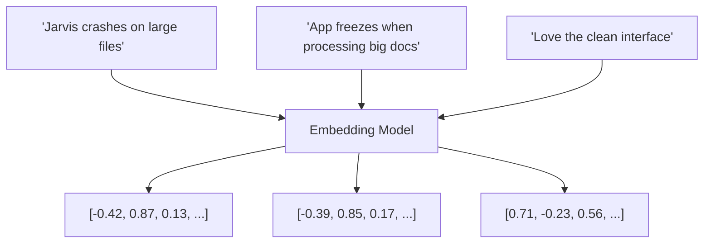

# Embeddings & Semantic Clustering

Sentiment tells you whether a review is positive or negative, but it doesn't tell you *what* the review is about. If 10 users all complain about slow response times, that's a pattern worth acting on. If one user loves the UI and another loves the UI in different words, they should be grouped together.

That's what **embeddings** and **clustering** are for.

## What is an embedding?

An embedding is a way of representing text as a list of numbers (a vector) such that **similar texts produce similar vectors**. The embedding model reads your text and outputs hundreds or thousands of decimal values — capturing the semantic meaning in a form that can be compared mathematically.



Vectors D and E are close to each other (both about crashes/freezes). Vector F points in a completely different direction (it's about the UI). The model has never seen these sentences before — it infers their meaning from the patterns it learned during training.

## Cosine similarity

To measure how close two vectors are, you use **cosine similarity**. It computes the angle between two vectors:

- **Score of 1.0** — vectors point in the same direction → very similar meaning
- **Score of 0.0** — vectors are perpendicular → unrelated topics
- **Score near -1.0** — opposite meaning

The `cosineSimilarity` function in :fileLink[`src/utils.js`]{path="src/utils.js" line=13} implements this. Your clustering algorithm will use a threshold of `0.75` — comments with similarity above that get grouped together.

## Create the clusterer

This is the most interesting module in the pipeline. It:
1. Calls the embeddings model to get a vector for each comment
2. Groups comments by comparing their vectors (anything above the similarity threshold clusters together)
3. Asks the LLM to name each cluster based on sample comments

Create a file named `src/processor/clusterer.js`:

```javascript save-as=src/processor/clusterer.js
import OpenAI from 'openai';
import config from '../config.js';
import { cosineSimilarity } from '../utils.js';

const client = new OpenAI({
  baseURL: config.openai.baseURL,
  apiKey: config.openai.apiKey,
});

async function getEmbedding(text) {
  const response = await client.embeddings.create({
    model: config.openai.embedding.model,
    input: text,
    encoding_format: 'float',
  });
  return response.data[0].embedding;
}

async function generateEmbeddings(comments) {
  const results = [];
  for (let i = 0; i < comments.length; i++) {
    process.stdout.write(`\r  Generating embedding ${i + 1}/${comments.length}...`);
    const embedding = await getEmbedding(comments[i].text);
    results.push({ ...comments[i], embedding });
  }
  console.log('\r  Done!                                          ');
  return results;
}

function performClustering(commentsWithEmbeddings) {
  const { similarityThreshold } = config.processor.clustering;
  const clusters = [];

  for (const comment of commentsWithEmbeddings) {
    let assigned = false;

    for (const cluster of clusters) {
      const similarity = cosineSimilarity(comment.embedding, cluster.centroid);

      if (similarity >= similarityThreshold) {
        // Add to this cluster and update the centroid (running average)
        const n = cluster.comments.length;
        cluster.centroid = cluster.centroid.map(
          (v, i) => (v * n + comment.embedding[i]) / (n + 1)
        );
        cluster.comments.push(comment);
        assigned = true;
        break;
      }
    }

    if (!assigned) {
      // No similar cluster found — start a new one
      clusters.push({
        id: clusters.length + 1,
        centroid: [...comment.embedding],
        comments: [comment],
      });
    }
  }

  return clusters;
}

async function generateClusterName(cluster) {
  const sampleTexts = cluster.comments
    .slice(0, 5)
    .map(c => `- ${c.text}`)
    .join('\n');

  const response = await client.chat.completions.create({
    model: config.openai.model,
    messages: [
      {
        role: 'system',
        content:
          'You identify common themes in product feedback. ' +
          'Respond with only a short theme label (3-5 words). No punctuation.',
      },
      {
        role: 'user',
        content: `What is the common theme in these comments?\n${sampleTexts}`,
      },
    ],
    temperature: 0.3,
    max_tokens: 20,
  });

  return response.choices[0].message.content.trim();
}

export async function clusterComments(comments) {
  console.log('  Generating embeddings...');
  const withEmbeddings = await generateEmbeddings(comments);

  console.log('  Clustering by semantic similarity...');
  const clusters = performClustering(withEmbeddings);

  console.log('  Naming clusters...');
  const clusterNames = {};
  for (const cluster of clusters) {
    clusterNames[cluster.id] = await generateClusterName(cluster);
  }

  // Attach cluster IDs to comments
  const clustered = withEmbeddings.map(comment => {
    const cluster = clusters.find(cl =>
      cl.comments.some(c => c.id === comment.id)
    );
    return { ...comment, clusterId: cluster?.id ?? 0 };
  });

  return { clustered, clusterNames };
}
```

## Update the processor

Update `src/processor/index.js` to add the clustering step:

```javascript save-as=src/processor/index.js
import { categorizeComments } from './categorizer.js';
import { clusterComments } from './clusterer.js';

export async function processComments(comments) {
  console.log('Step 1: Analyzing sentiment...');
  const categorized = await categorizeComments(comments);

  console.log('Step 2: Clustering with embeddings...');
  const { clustered, clusterNames } = await clusterComments(categorized);

  const categories = clustered.reduce((acc, c) => {
    acc[c.category] = (acc[c.category] || 0) + 1;
    return acc;
  }, {});

  const clusterCount = Object.keys(clusterNames).length;
  console.log(`  Found ${clusterCount} cluster(s):`);
  for (const [id, name] of Object.entries(clusterNames)) {
    const count = clustered.filter(c => c.clusterId === Number(id)).length;
    console.log(`    Cluster ${id}: "${name}" — ${count} comment(s)`);
  }

  return {
    metadata: {
      totalComments: comments.length,
      processedAt: new Date().toISOString(),
      categories,
      clusters: { count: clusterCount, names: clusterNames },
    },
    // Strip embeddings from output — they're large and not useful in the final JSON
    comments: clustered.map(({ embedding, ...rest }) => rest),
    features: [],
  };
}
```

## Run and observe the clusters

Rebuild the image and run the app:

1. Rebuild:

    ```bash
    docker compose build
    ```

2. Run:

    ```bash
    docker compose run --rm app
    ```

You should see output like:

```plaintext no-copy-button
Step 2: Clustering with embeddings...
  Generating embeddings...  Done!
  Clustering by semantic similarity...
  Naming clusters...
  Found 4 cluster(s):
    Cluster 1: "Ease of Use and Accuracy" — 11 comment(s)
    Cluster 2: "Crashing and Performance Issues" — 5 comment(s)
    Cluster 3: "Pricing and Value" — 3 comment(s)
    Cluster 4: "Documentation Quality" — 1 comment(s)
```

The cluster names and sizes will vary based on the comments that were generated. That's normal — the LLM reads the actual text and derives the theme dynamically.

Open :fileLink[data/results.json]{path="data/results.json"} and look at the `metadata.clusters.names` section. Each comment in the `comments` array now has a `clusterId` field showing which group it belongs to.

> [!TIP]
> Try adjusting `similarityThreshold` in `src/config.js`. Lowering it (e.g., to `0.65`) will create fewer, broader clusters. Raising it (e.g., to `0.85`) will create more, narrower ones. Save the file and watch the pipeline re-run automatically.

You've just implemented semantic clustering using vector embeddings — a technique used in production recommendation systems, search engines, and knowledge bases. In the final section, you'll use the clusters to extract actionable features and generate responses to each review.
